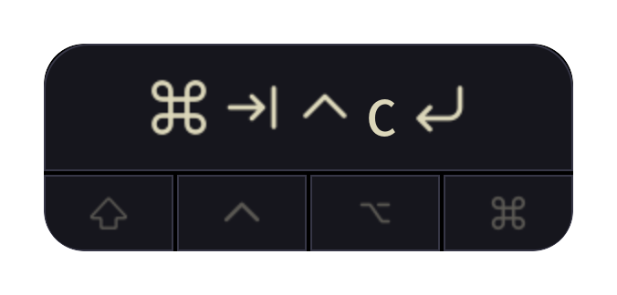

# KeyRC

A small always-on-top keystroke display drawn natively with GTK 3 and Cairo.
It uses a single process and does not embed WebKit.

<p align="center">
  
</p>

## Configuration

KeyRC reads `~/.config/keyrc/config.toml`. Mode, opacity, keymap, and color
changes apply live. The file has one mode, one opacity value, two shortcuts,
and five colors:

```toml
[general]
mode = "keys_only"
opacity = 1.0

[keymap]
toggle_mode = "Ctrl+Alt+M"
quit = "Ctrl+Alt+Q"

[colors]
active_bg = "#121c29"
active_fg = "#719cd6"
key_text = "#c0c8d5"
background = "#192330"
border = "#252f3c"
```

ThemeSync writes the five colors directly into this file when the desktop theme
changes, preserving `[general]`, `[keymap]`, and other settings. There is no
separate KeyRC theme file or palette import. Without ThemeSync, edit these colors
yourself. A minimal example is in [config.example.toml](config.example.toml).

All pressed modifiers share `active_bg` and `active_fg`. Inactive symbols use
`key_text` at 35% opacity. `background` fills the key row and inactive modifier
cells; `border` outlines them. Colors accept `#RRGGBB` or `#RRGGBBAA`; invalid or
missing colors use black/white defaults.

`general.mode = "full"` (the default) shows the key history and modifier row at 290 × 114.
`"keys_only"` shows only the key history at 290 × 70 with all four corners rounded.
`general.opacity` controls the opacity of the entire popup from `0.0` to `1.0`
and defaults to `1.0`. Opacity changes apply live.
Modifiers appear once within each combination in both modes. When a modifier
stays held for another key, KeyRC repeats it so each combination remains clear;
for example, holding `Super` across `Tab` then `1` shows
`Super Tab Super 1`. Shift combinations keep the letter label lowercase; Caps
Lock makes letters uppercase.

Missing or malformed TOML uses the default colors and `full` mode. Unknown mode
values use `full`. KeyRC reads only its own configuration file.

Press `Ctrl+Alt+M` to toggle between `full` and `keys_only`, or `Ctrl+Alt+Q` to
quit KeyRC. Change `keymap.toggle_mode` and `keymap.quit` to other combinations;
modifier names are `Ctrl`, `Alt`, `Shift`, and `Super`. Both shortcuts update
live when `config.toml` changes.

## Window position

Position is runtime state stored outside the configuration directory. X11 uses
`$XDG_CACHE_HOME/keyrc/position` and Wayland uses
`$XDG_CACHE_HOME/keyrc/position-wayland`. Moves save the position atomically.
X11 coordinates are physical pixels and can be negative on multi-monitor
desktops. Wayland layer-shell positions are non-negative margins from the top
left of the compositor-selected output.

The native window restores its size, mode, and cached position before it is
shown. This avoids displaying it at the default position before moving it.
The popup remains visible on every workspace. It does not accept focus and
cannot be closed through the window manager; dragging is its only direct
interaction. Use the tray icon to toggle display mode or quit KeyRC. A missing
or invalid cache uses the window manager's default placement.

## Development

Build the standalone release binary with:

```sh
cargo build --release --locked
```

The output is `target/release/keyrc`. Runtime dependencies are GTK 3 and
AppIndicator. X11 capture uses XRecord. Wayland capture reads Linux evdev
keyboards from `/dev/input/event*`, so the user running KeyRC needs read access
to the input devices. On distributions using an `input` group, log out and back
in after adding the user to that group.

On KDE Plasma Wayland, KeyRC uses layer-shell for a non-focusable overlay that
stays above normal windows and appears on every workspace. Compositors without
layer-shell support fall back to a normal non-focusable GTK window. Set
`KEYRC_BACKEND=x11` or `KEYRC_BACKEND=wayland` to override automatic backend
detection while debugging.

## Install

Run the user-local installer from the repository root:

```sh
./scripts/install.sh
```

It builds the release binary and installs:

- `~/.local/bin/keyrc`
- `~/.local/share/applications/keyrc.desktop`
- `~/.local/share/icons/hicolor/1024x1024/apps/keyrc.png`

The desktop launcher and tray use the original KeyRC icon from the Tauri app.
Use `--no-build` to install an existing release binary or `--no-start` to avoid
restarting KeyRC after installation. `XDG_DATA_HOME` and `KEYRC_BIN_DIR` are
respected when set.

Special-key SVGs follow KeyCastr's symbol set without requiring Apple fonts.
See [THIRD_PARTY_NOTICES.md](THIRD_PARTY_NOTICES.md) for attribution.

## Releases

GitHub Actions checks formatting, runs Clippy and tests, builds the optimized
Linux x86_64 binary, and stores it as a workflow artifact. To publish a GitHub
Release, update the version in `Cargo.toml`, commit it to `main`, then push the
matching tag:

```sh
git tag v0.1.0
git push origin v0.1.0
```

The release contains a `.tar.gz` package and its SHA-256 checksum. The Release
workflow can also be run manually for an existing tag.

## License

KeyRC is available under the [MIT License](LICENSE).
